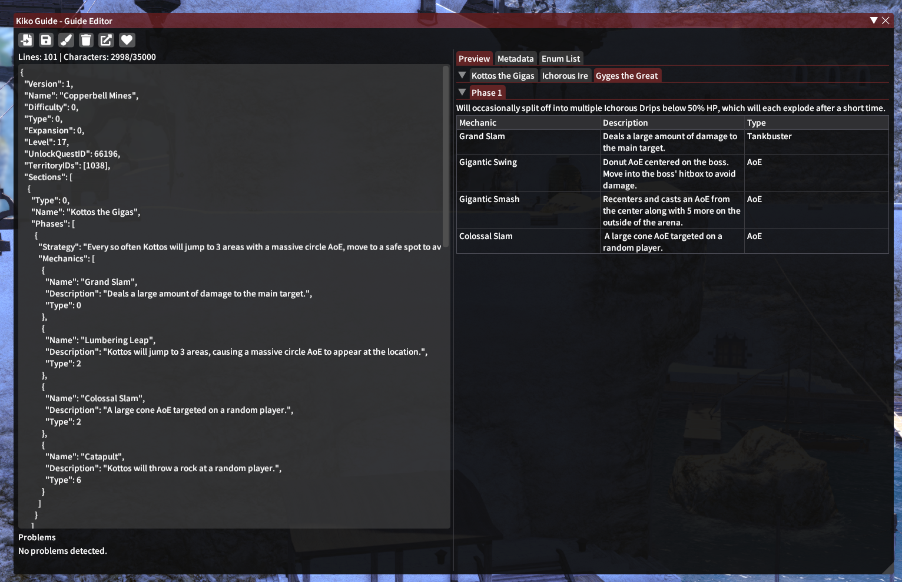

  
# Contributing Guide
  

### Table of Contents

- [Localization Contribution](#localization-contribution)
- [Code Contribution](#code-contribution)
- [Guide Contribution](#guide-contribution)

---

## Localization Contribution
#### Plugin Text
All plugin source strings are regularly published to [Crowdin](https://crowdin.com/project/KikoGuide) for easy translation. If you want to translate a language that is not listed, please open an issue. All translation files are automatically synced up with the repository after a review.

#### Guide Localizations
Guide localization, while supported by KikoGuide, is not available through Crowdin at the moment. The localization system for Guides is in a weird state, as soon as 1 guide is available for a given language the plugin will automatically ignore all guides in any other language and only load those. A lot of work needs to be done to improve the system, and any support is appreciated from other developers.

---

## Code Contribution
Before making any code/functionality changes to KikoGuide, please first check that the changes comply with the [Dalamud Plugin Rules](https://goatcorp.github.io/faq/development#q-what-am-i-allowed-to-do-in-my-plugin). Any changes that do not comply will not be merged.

It is recommended you open an issue if you wish to improve on or add additional functionality to the plugin.

#### Building
When setting up a development environment it is recommended to use the provided [dev container](./.devcontainer) setup, as it will automatically handle installing and configuring the development environment for you. If you want to develop on your local machine instead of a container then you can find a guide [here](https://goatcorp.github.io/faq/development). 

Please note if you are using Linux you must set the `DALAMUD_HOME` environment variable to wherever your Dalamud development folder is located. (this is done for you if using the container environment).

#### Code Standards
A `.editorconfig` file has been provided in the repository, please ensure that all code changes follow along with the rules outlined in that file where possible.

#### Functionality 
Please ensure that all code is properly separated based on its functionality and work towards achieving proper encapsulation where possible. For example, UI elements should not contain any logic that will not be used for drawing itself or displaying information, fetching the information it is displaying should be fetched from a separate class in a different file, like a presenter or service.

#### Documentation & Comments
Please write `
` comments for functions, methods and classes to help understand the intentions behind the code, and to help others understand how to use it when working with the plugin.

---
 
## Guide Contribution
Guide contributions are relatively simple to make, and should not require any highly-technical knowledge. There should already be files in the repository for most duties in the game already, and new ones will be added when expansions release after a few days. Please note that this repository may not be checked around patch days to avoid spoiling new content. 

#### Editing Guides
Guides are stored as `.json` files inside of the `KikoGuide/Resources/Localization/Duty/<version>/<lang>/` folder, and are named their exact English in-game name no matter the language they are for. When changing these files, it is important you run them through a JSON validator as otherwise the plugin may not be able to load them. It is also recommended to run the file through a quick grammar/spell checker when appropriate.

It is **highly recommended** to use the guide editor that is apart of KikoGuide, you can access this at `/kikoeditor`. KikoGuide's guide editor will automatically detect when guide file is unloadable; It will also provide you with a preview of how the guide will look in the guide viewer, and provide you with IDs you may need while editing.

##### Editor Preview

##### Guide JSON File Keys
- `Version`: The duty file version, do not change this manually.
- `Name`: The name of the duty
- `Difficulty`: The difficulty ID of the duty
- `Type`: The type ID of the duty
- `Expansion`: The expansion ID of the duty
- `Level`: The level of the duty in-game
- `UnlockQuestID`: The [quest ID](https://github.com/xivapi/ffxiv-datamining/blob/master/csv/Quest.csv) that unlocks the duty
- `TerritoryIDs`: The territory ID(s) to automatically open the guide for
- `Sections`: The sections of the guide
  - `Type`: The type of section
  - `Name`: The name of the section (usually the name of the boss)
  - `Phases`: The phases of the section
    - `TitleOverride`: The title of the phase (Optional, you do not need to set this 99.99% of the time)
    - `Strategy`: The strategy for the phase
    - `StrategyShort`: The short strategy for the phase used when enabled in the settings
    - `Mechanics`:
      - `Name`: The name of the mechanic
      - `Description`: The description of the mechanic
      - `ShortDescription`: The short description of the mechanic used when enabled in the settings
      - `Type`: The type of mechanic
    - `Notes`:
      - `Text`: The text of the note
      - `TextShort`: The shortened text of the note

When writing descriptions of mechanics or sections, please try to keep in mind the terminology the player may or may not be aware of at the given level, it is good practice to explain things if you believe the player may be unsure. It is also **highly** requested that you provide "short" versions of all explainations in the given fields (eg. "StrategyShort", "ShortDescription") as it helps make guides more accessabile to readers.

#### Formatting Tips
- `\n` will act as a new line, you can use `\n\n` to start a new paragraph with a space inbetween.
- `\t` will act as a tab space.
- `%%` will show up as a single percent symbol, single percent symbols do not show.

#### Guide Enums (DutyType, MechanicTypes, DutyDifficulty, etc)
You can find all internal IDs used for identifying duty data inside of the [Guide Type](KikoGuide/Types/Guide.cs) of the repository or inside of the in-game editor (`/kikoeditor`)

#### Game IDs (Quest, Territory, etc)
You can find all game IDs through the csv files available from the FFXIV-Datamining repository [here](https://github.com/xivapi/ffxiv-datamining)

If for whatever reason you are struggling to locate any of these IDs, feel free to make the pull request without them and clarify that in the request and they will be added for you. If you do not know what to put in a field, please just do not add it to the file, do not add a placeholder value as it will cause issues when the plugin tries to load the file.

--- 
###### See Also
- [Commit Convention](COMMIT_CONVENTION.md)
- [FFXIV Wiki](https://ffxiv.consolegameswiki.com)
- [FFXIV-Datamining](https://github.com/xivapi/ffxiv-datamining)
