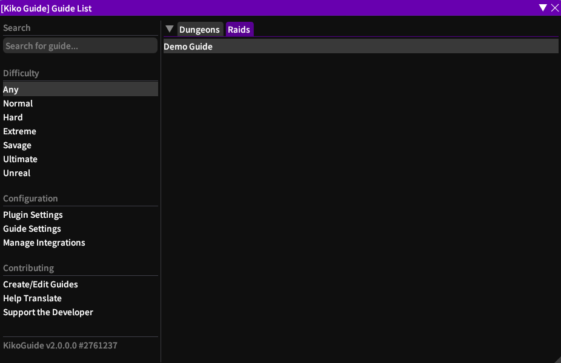
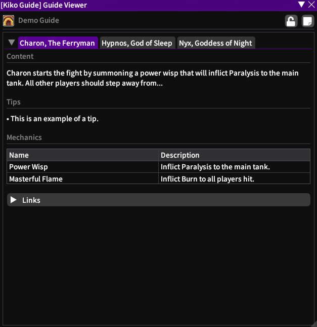

  
### Kiko Guide

A [Dalamud](https://github.com/goatcorp/Dalamud) plugin providing a powerful & accessible guide system for creating guides to in-game content. 

 

**[Issues](https://github.com/Blooym/KikoGuide/issues) · [Contributing](https://github.com/Blooym/KikoGuide/blob/main/CONTRIBUTING.md) · [Translating](https://github.com/Blooym/KikoGuide/blob/main/TRANSLATING.md)**
  

---

## About

Coming soon!

## Installation

KikoGuide is currently not considered stable and therefore is only available to users who have opted into testing builds of plugins in the Dalamud settings. If you have this enabled, you can install KikoGuide by simply searching for "Kiko Guide" in the plugin installer.

## Screenshots

These screenshots are from the development version of KikoGuide and may not reflect how the plugin will appear in a stable release.

<!-- Dropdowns -->

Guide List

Guide View

## Contributing

### Guides & Code Contributions

You can find information on contributing to KikoGuide [here](./CONTRIBUTING.md).

### Translation & Localization

You can find information on translating KikoGuide [here](./TRANSLATING.md).